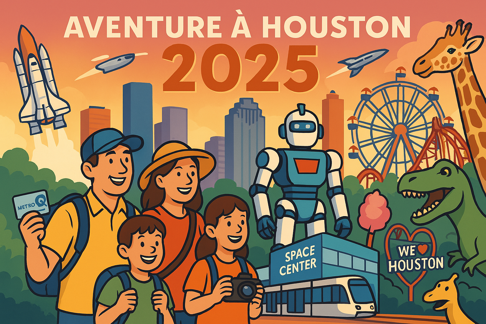

# Guide de Voyage Houston 2025

## 🌟 Bienvenue dans votre guide de voyage pour Houston 2025

Ce guide a été spécialement conçu pour votre séjour à Houston du 14 au 24 avril 2025, incluant votre participation au FIRST Championship. Il combine clarté visuelle, informations essentielles et conseils pratiques pour une expérience optimale.

## 📋 Sections Principales

### [01. Introduction et Sommaire](Main_Sections/01_Introduction.md)
Vue d'ensemble du voyage, dates clés et informations essentielles.

### [02. Space Center & Kemah Boardwalk](Main_Sections/02_Space_Center_Kemah.md)
Journée 20 avril: Exploration spatiale et divertissement en bord de mer.

### [03. Shopping à Katy Mills](Main_Sections/03_Shopping_Katy_Mills.md)
Journée 21 avril: Aventure shopping dans le plus grand outlet de Houston.

### [04. Sécurité et Logistique](Main_Sections/04_Safety_Logistics.md)
Informations pratiques sur les transports, contacts d'urgence et conseils de sécurité.

### [05. Guide Gastronomique](Main_Sections/05_Gastronomie.md)
Recommandations de restaurants par catégorie et conseils culinaires.

### [06. FIRST Championship](Main_Sections/06_FIRST_Championship.md)
Journées 16-19 avril: Guide complet de l'événement robotique mondial.

### [07. Museum District](Main_Sections/07_Museum_District.md)
Journée 22 avril: Exploration des musées de renommée mondiale de Houston.

### [08. Hermann Park et Zoo](Main_Sections/08_Hermann_Park_Zoo.md)
Journée 23 avril: Découverte de la faune et de la flore dans un cadre magnifique.

## 📚 Annexes

### [A. Cartes et Transport](Annexes/A_Transport_Maps.md)
Plans détaillés, options de transport et itinéraires.

### [B. Contacts d'Urgence](Annexes/B_Emergency_Contacts.md)
Liste complète des numéros d'urgence et services médicaux.

### [C. Comparatif Shopping](Annexes/C_Shopping_Comparison.md)
Analyse détaillée des centres commerciaux et outlets.

### [D. Guide Touristanbul](Annexes/D_Touristanbul.md)
Informations sur l'excursion gratuite à Istanbul lors de votre escale.

### [E. Guide Local - Manger & Acheter](Annexes/E_Local_Dining_Shopping.md)
Découverte des quartiers, spécialités culinaires et boutiques uniques de Houston.

## 💡 Comment utiliser ce guide

- **Navigation**: Utilisez les liens hypertextes pour naviguer entre les sections.
- **Checklists**: Chaque section contient une checklist essentielle à vérifier.
- **Alertes**: Repérez les symboles ⚠️ pour les informations critiques.
- **Conseils familiaux**: Les sections 👨👩👧👦 sont spécialement conçues pour les enfants de 10 ans.

---

*Ce guide a été préparé avec soin pour votre famille, en tenant compte de vos préférences pour les transports en commun et les activités adaptées aux enfants de 10 ans.*
