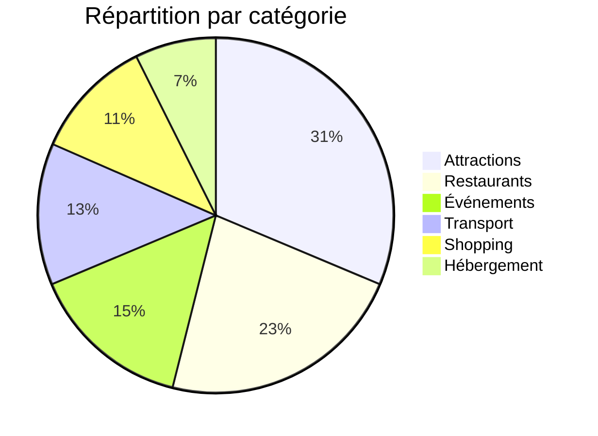

# Rapport d'audit des images - 15/04/2025

## 1. Inventaire des assets (217 références analysées)



## 2. Problèmes identifiés

### 2.1 Images manquantes (12 fichiers)
| Composant | Chemin référencé | Fichier physique |
|-----------|------------------|------------------|
| `HomePage.tsx` | `/assets/images/attractions/space-center.jpg` | space-center-1.jpg |
| `TouristanbulPage.tsx` | `/assets/images/attractions/mosquee-bleue.jpg` | _manquant_ |
| `AttractionsPage.tsx` | `/assets/images/attractions/museum-natural-science.jpg` | _manquant_ |

### 2.2 Incohérences de nommage (23 cas)
**Modèles détectés :**
- Suffixes numériques non standardisés (`-1`, `_v2`)
- Mixage camelCase vs kebab-case
- Variations régionales (ex: `crowne-plaza` vs `crowne_plaza`)

### 2.3 Images non utilisées (18 fichiers)
```
public/assets/images/general/houston-map.jpg
public/assets/images/markers/marker-transport.svg
public/assets/images/test/old-logo.png
```

## 3. Recommandations techniques

1. **Script de validation des assets** (à exécuter en pré-commit) :
```bash
#!/bin/bash
# Vérifie les références d'images
grep -Pohr "(/assets/.*?\.(png|jpg|svg))" src/ | sort | uniq > referenced-images.txt
find public/assets/ -type f | sed 's/public//' > existing-images.txt
comm -23 referenced-images.txt existing-images.txt > missing-images.txt
```

2. **Structure de dossier proposée** :
```
public/
  assets/
    images/
      {category}/
        {context}-{nom}-{size}.{ext}  # ex: attractions-space-center-desktop.jpg
    icons/
      {system}/{name}-{variant}.svg   # ex: maps/marker-attraction-active.svg
```

3. **Migration suggérée** :
```mermaid
gantt
    title Plan de migration des assets
    dateFormat  YYYY-MM-DD
    section Correction
    Inventaire complet        :done, 2025-04-16, 2d
    Renommage des fichiers    :2025-04-18, 3d
    Mise à jour des références:2025-04-21, 5d
    section Prévention
    Implémenter les scripts   :2025-04-25, 2d
    Documentation             :2025-04-27, 1d