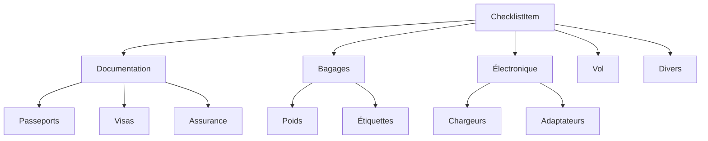

# Migration Plan for Checklist Component

## Objectif
Intégrer la checklist de préparation voyage (lignes 320-356) dans React avec les fonctionnalités interactives



## Étapes d'implémentation

1. **Créer un composant Checklist**
```tsx
// components/Checklist/Checklist.tsx
interface ChecklistItem {
  id: string;
  label: string;
  checked: boolean;
}

export const Checklist = ({ items }: { items: ChecklistItem[] }) => {
  const [checkedItems, setCheckedItems] = useState<Set<string>>(new Set());

  const toggleItem = (id: string) => {
    const newChecked = new Set(checkedItems);
    newChecked.has(id) ? newChecked.delete(id) : newChecked.add(id);
    setCheckedItems(newChecked);
  };

  return (
    <div className="checklist">
      {items.map(item => (
        <label key={item.id} className="checklist-item">
          <input 
            type="checkbox" 
            checked={checkedItems.has(item.id)}
            onChange={() => toggleItem(item.id)}
          />
          {item.label}
        </label>
      ))}
    </div>
  );
};
```

2. **Intégrer dans LocalDiningShoppingPage**
```tsx
// pages/LocalDiningShoppingPage.tsx
const checklistItems = [
  { id: 'doc-1', label: 'Passeports (validité > 6 mois)' },
  { id: 'doc-2', label: 'Visas américains' },
  // ... autres éléments
];

const PreparationChecklist = () => (
  <Section title="Checklist de préparation">
    <Checklist items={checklistItems} />
  </Section>
);
```

3. **Styles CSS (via CSS Modules)**
```css
/* components/Checklist/Checklist.module.css */
.checklist-item {
  display: flex;
  align-items: center;
  gap: 0.75rem;
  padding: 0.5rem;
  border-radius: 4px;
  transition: background 0.2s;
}

.checklist-item:hover {
  background: #f0f4ff;
}

.checklist-item input[type="checkbox"] {
  width: 1.25rem;
  height: 1.25rem;
}
```

## Prochaines étapes
1. Implémenter la persistance avec localStorage
2. Ajouter des catégories repliables
3. Intégrer des icônes pour chaque type d'élément
4. Ajouter une fonctionnalité d'export PDF